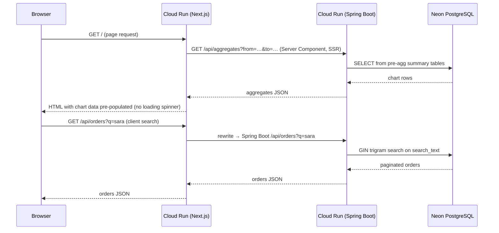

# dashboard-nextjs — Next.js 16 App Router + Spring Boot + GCP Cloud Run

Production-grade **Next.js 16 / TypeScript** orders dashboard with Server-Side Rendering: the aggregates
chart arrives pre-populated on first paint via a Server Component that fetches the last-30-days summary
at request time. API calls are proxied to the Spring Boot backend via `next.config.ts` rewrites — no
Nginx layer. Deployed as a Next.js standalone image to GCP Cloud Run via **Pulumi TypeScript IaC**.

---

## Live Service

| Endpoint | URL |
|---|---|
| **Dashboard** | https://dash-nextjs-full-frontend-77y7e2wykq-uc.a.run.app |
| **Portfolio demo** | https://bganguly.github.io/#orders_dashboard |

> Cloud Run scales to zero when idle; the first request may take a few seconds to wake.

---

## Using the App

1. **Aggregates chart** — arrives pre-populated on first paint (SSR Server Component fetches last-30-day aggregates at request time, no loading spinner). Drag the brush to zoom into any date window.
2. **Search** — type in the search bar to query orders across all columns via the backend's `search_text` GIN trigram index; sub-second on 4 M+ rows.
3. **Filter** — sidebar narrows by status, region, date range, or total amount; filters compose with search.
4. **Dark mode** — toggle between light / dark / system via the top-right control; preference persisted to `localStorage`.

---

## Architecture

### Request flow

1. **Browser → Cloud Run (Next.js)** — page request triggers a Server Component that calls the Spring Boot backend directly (`SPRING_API_URL` env var) to pre-fetch the last-30-days aggregates.
2. **SSR response** — Next.js renders the page with the chart data embedded; browser receives a fully-populated HTML document.
3. **Client API calls** — subsequent search / filter requests go to `/api/*` on the Next.js host; `next.config.ts` rewrites forward them to the backend.
4. **Backend** — Spring Boot on Cloud Run, backed by Neon serverless PostgreSQL.



### Topology

```
┌──────────────────────────────────────────────────────────────────────────┐
│                              GCP Project                                 │
│                                                                          │
│   Artifact Registry                                                      │
│   ┌──────────────────┐    ◄── gcloud builds submit (deploy.sh)          │
│   │  frontend image  │         Next.js standalone output                │
│   └──────────────────┘                                                  │
│           │ image pull                                                   │
│           ▼                                                              │
│   Cloud Run: dash-nextjs-[lite|full]-frontend                           │
│   ┌──────────────────────────────────────────────────────────────────┐  │
│   │ Next.js 16 App Router (port 3000)                                │  │
│   │ • Server Component — SSR aggregates fetch on page load           │  │
│   │ • next.config.ts rewrites /api/* → SPRING_API_URL               │  │
│   │ • output: standalone (no node_modules on runner)                 │  │
│   │ • lite: min=0 instances  │  full: min=1 instance                 │  │
│   └──────────────────────────┬───────────────────────────────────────┘  │
│                              │ HTTPS (SPRING_API_URL)                    │
│   Cloud Run: dash-full-backend                                           │
│   ┌──────────────────────────▼───────────────────────────────────────┐  │
│   │ Spring Boot 3 (port 8080)                                        │  │
│   │ • REST /api/orders, /api/aggregates, /api/regions, /api/runtime  │  │
│   │ • Flyway migrations                                              │  │
│   └──────────────────────────┬───────────────────────────────────────┘  │
│                              │ JDBC (Neon pooler)                        │
│   ┌──────────────────────────▼───────────────────────────────────────┐  │
│   │ Neon serverless PostgreSQL                                       │  │
│   │ • orders (4 M+ rows)                                             │  │
│   │ • search_text GIN trigram index                                  │  │
│   │ • pre-aggregated summary tables                                  │  │
│   └──────────────────────────────────────────────────────────────────┘  │
│                                                                          │
│   Pulumi TypeScript (infra/index.ts) manages frontend Cloud Run service  │
└──────────────────────────────────────────────────────────────────────────┘

Deploy flow
───────────
local machine
  └─ deploy.sh
       ├─ [1] local   → npm run dev on :3000
       ├─ [2] lite    → gcloud builds submit → Artifact Registry
       │                → pulumi up (min=0 Cloud Run)
       └─ [3] full    → gcloud builds submit → Artifact Registry
                        → pulumi up (min=1 Cloud Run)
```

### Key design decisions

| Concern | Approach |
|---|---|
| **SSR pre-population** | Root `page.tsx` is a Server Component — fetches last-30-days aggregates at request time and passes them as `initialData` props to the Chart Client Component; chart renders on first paint without a loading state. |
| **API proxy** | `next.config.ts` `rewrites()` forward `/api/**` to `SPRING_API_URL` — single origin for the browser, no CORS, no Nginx sidecar. |
| **No hardcoded host** | All backend calls go through the `SPRING_API_URL` env var (SSR) or the rewrite (client); swapping environments requires only one env var change. |
| **Standalone output** | `output: "standalone"` in `next.config.ts` — produces a self-contained server bundle; Docker image does not include `node_modules`. |
| **Image build** | `gcloud builds submit` — no local Docker required. Content-hash tag (`sha256` of source files) skips rebuilds when source is unchanged. |
| **Pagination** | Keyset cursor `(placedAt, orderId)` — O(1) deep-page navigation, no OFFSET scans. |

---

## Stack

| Component | Implementation |
|---|---|
| **Next.js / TypeScript full-stack** | Next.js 16, React 19, TypeScript, Tailwind CSS, Recharts |
| **SSR** | App Router Server Components — aggregates pre-fetched on the server at request time |
| **API proxy** | `next.config.ts` rewrites — no Nginx, single-origin for browser |
| **Backend** | Spring Boot 3 (sibling repo `springboot-dashboard-backend`) on Cloud Run |
| **Database** | Neon serverless PostgreSQL — GIN trigram index on `search_text`; pre-aggregated summary tables for chart |
| **IaC** | Pulumi TypeScript (`infra/index.ts`) — Cloud Run service, IAM, `SPRING_API_URL` env |
| **Image build** | `gcloud builds submit` — remote Cloud Build, no local Docker |

---

## Deployment / Running

```bash
./scripts/deploy.sh      # [1] local dev · [2] lite (scale-to-zero) · [3] full (min 1 instance)
./scripts/infra-down.sh  # [1] stop local · [2] destroy lite · [3] destroy full
```

| Action | Script | Prompt |
|---|---|---|
| Start local dev server (port 3000) | `./scripts/deploy.sh` | `[1]` |
| Deploy lite to GCP (scale-to-zero) | `./scripts/deploy.sh` | `[2]` |
| Deploy full to GCP (always warm) | `./scripts/deploy.sh` | `[3]` |
| Stop local dev server | `./scripts/infra-down.sh` | `[1]` |
| Teardown GCP lite stack | `./scripts/infra-down.sh` | `[2]` |
| Teardown GCP full stack | `./scripts/infra-down.sh` | `[3]` |

Deploy backend first (`springboot-dashboard-backend`) before deploying this service — `deploy.sh` reads the backend's Pulumi output for `SPRING_API_URL`.

### Cost

| Resource | Cost |
|---|---|
| **Cloud Run (lite)** | Scale-to-zero — ~$0 when idle |
| **Cloud Run (full)** | Min 1 instance — ~$5–10/mo |
| **Artifact Registry** | Negligible at demo image count |
| **Cloud Build** | Negligible at demo build frequency |

---

## Scale & Performance

> **4 M+ orders** served with sub-second search and chart responses. SSR delivers the chart pre-populated on first paint — no client-side loading spinner for the initial aggregate view.

```
Browser ──HTTPS──► Cloud Run (Next.js) ──rewrites /api/*──► Cloud Run (Spring Boot) ──JDBC──► Neon PG
                   SSR aggregates fetch at page load         4 M+ orders
                   output: standalone · port 3000            GIN trigram + pre-agg tables
```

---

## Features

- **SSR aggregates** — Server Component fetches last-30-days chart data at request time; chart is pre-populated in the initial HTML response
- **Orders table** — paginated (keyset cursor), sortable, filter sidebar (status, region, date range, total range)
- **Full-text search** — multi-token AND search across all visible columns via backend GIN trigram index on `search_text`; sub-second on 4 M+ rows
- **Aggregates chart** — stacked bar chart of daily orders by product category; drag the brush to zoom into any date window
- **Dark mode** — system-preference detection via `useIsDark` hook (MutationObserver on `document.documentElement`); light / dark / system toggle
- **API proxy** — Next.js rewrites forward `/api/*` to Spring Boot; browser sees a single origin, no CORS
